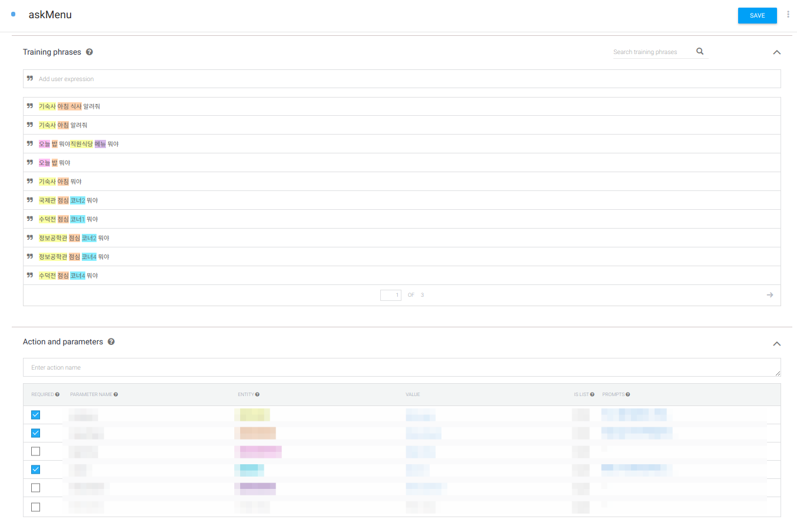
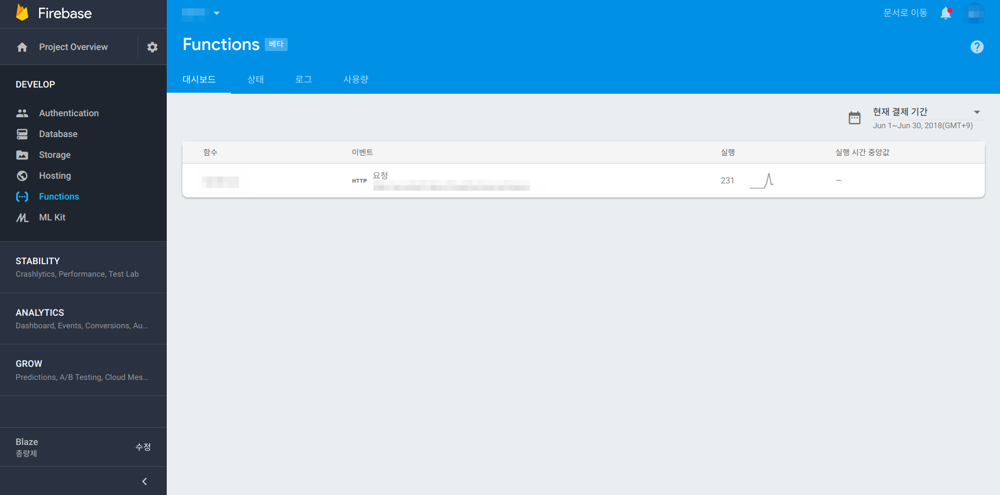
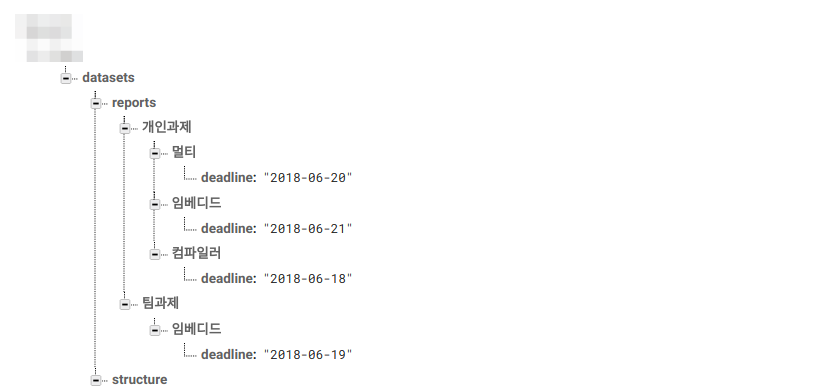
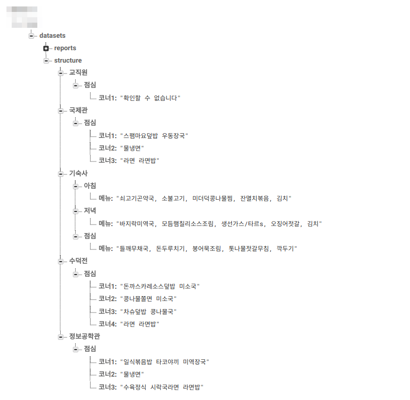
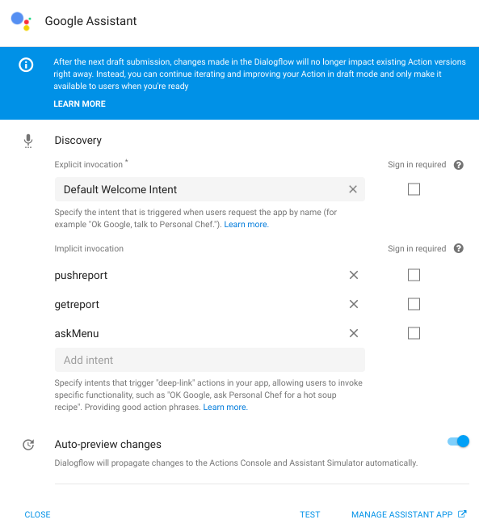
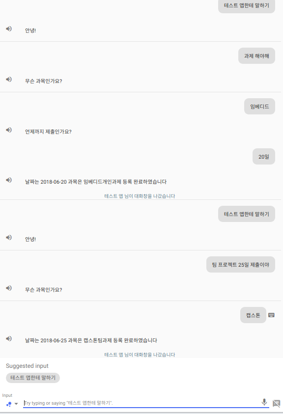

## Connect Dialogflow & Firebase with Fullfillment

---

**Related file : src/firebase/dialogflowSetting/firebase_schedule , src/getFoodlist**
<br>

### 1. DialogFlow Setting
<br>

1. **Make Actions console project**
<br>
    - https://console.actions.google.com/
    <br>
    
<br>
2. **Enable Google Assistant API**
<br>
    - https://console.developers.google.com/apis/api/embeddedassistant.googleapis.com/overview
    <br>
    
<br>
3. **Register Device (ex : raspberry pi3)**
<br>
    - https://console.actions.google.com/
    <br>
    
    <br>
    - **If you can't find 'device restration' section**
    <br>
      - https://developers.google.com/assistant/sdk/guides/service/python/extend/custom-actions
    <br>
      - make json and make information
    <br>
    - **Download Credential.json**
    <br>
<br>
4. **Configure Environment**
<br>
    - **python3**
    <br>
    ```python
    sudo apt-get update
    sudo apt-get install python3-dev python3-venv
    python3 -m venv env
    env/bin/python -m pip install --upgrade pip setuptools wheel
    source env/bin/activate
    ```
    <br>

    - **python2.7**
    <br>
    ```python
    sudo apt-get update
    sudo apt-get install python-dev python-virtualenv
    virtualenv env --no-site-packages
    env/bin/python -m pip install --upgrade pip setuptools wheel
    source env/bin/activate
    ```

    <br>

    - **Get package**
    <br>
    sudo apt-get install portaudio19-dev libffi-dev libssl-dev
    <br>
    python -m pip install --upgrade google-assistant-sdk[samples]

    <br>

    - **Generate credentials**
    <br>
    python -m pip install --upgrade google-auth-oauthlib[tool]
    google-oauthlib-tool --scope https://www.googleapis.com/auth/assistant-sdk-prototype --save --headless --client-secrets **/path/to/credentials.json**
    <br>

---

### 2. DialogFlow Setting

<br>

[google Examples](https://developers.google.com/actions/dialogflow/first-app)
<br>

1. **Make Agent**
  <br>
  - Make agent and select google project you created before
  <br>
  
  <br>

2. **Make Entities**
  <br>
  
  <br>

3. **Make Intent**
<br>
  - **Most Important Thing**
  <br>
  - **Intent will be export in your app later with firebase functions. Remeber name of Intent!!**
  <br>
  - I user only **Training phrases, Actions and and parameters, Fullfillment** sections.
  <br>

    |SECTION|INFO|
    |--------|---|
    |Training phrases|input what you will ask to assistant|
    |Action and parameters|check your entities, required, prompts. You will use **PARAMETER NAME** in firebase functions, so remove '-' in its name
    |Prompts|make som quistions assistant ask to you for get entity|
    |Fullfillment|check **Enable webhook call for this intent** |


<br>

4. **EX**
<br>
    - **intent_list**
    <br>
    
    <br>
    - **intent info**
    <br>
    
    <br>

---
### 3. Firebase Setting

<br>

1. **Install NodeJS**
<br>
  - [install NodeJS](https://nodejs.org/)
<br>

2. **Set Up**
<br>  
  ```shell
  npm install -g firebase-tools
  firebase login
  mkdir firebase_schedule
  cd firebase_schedule
  firebase init
  ```
<br>    

  - **select google project we made before** and **choose functions with space bar**
  <br>
  - make functions/index.js, functions/package.json
  <br>
  - You can get related file in src/firebase/dialogflowSetting/firebase_schedule
  <br>
  - **for use actions on google and firebase** add follow code in functions/package.json
  <br>
  <br>
  ```json
  "devDependencies": {
  "eslint": "^4.12.0",
  "eslint-plugin-promise": "^3.6.0"
  },
  "dependencies": {
    "actions-on-google": "^2.0.0",
    "firebase-admin": "^5.12.1",
    "firebase-functions": "^1.0.4"
  },
  ```

<br>

3. **Deploy firebase**
<br>
- **run follow code in your firebase_schedule/functions**
<br>
  ```shell
  npm install
  firebase deploy --only functions
  ```
  <br>

- You can get URL for fullfillment with Dialogflow in result.
<br>
- **Or you can check you url in firebase functions tab**
<br>

<br>
<br>

4. **Firebase Database Setup**
  <br>
  - **You can get json file to input structure datasets in src/getFoodList**
  <br>
  - To use Our code, you need two databases in FIREBASE. We use 2 databases.
  <br>
  - **\<projet name>/\<Database name>/datasets/reports**
  <br>
    - generated automatically
    <br>
  - **\<project name>/\<Databse name>/datasets/structure**
  <br>
    - (structure) should be pre-built in
    <br>
    - You can run python scrapping code or insert data manually
    <br>

  - **EX**
  <br>
    
    <br>
    
    <br>

---

### 4. **Intergration**
<br>

1. **Test Your Dialogflow**
<br>
  - You can check response/request with json type in the right area of ​​the screen.
  <br>
  
  <br>
  
  <br>

2. **Intergration**
<br>
  - **Integration your Dialogflow to google assistant**
  <br>
  
  <br>
  - **add your own intent**
  <br>
  
  <br>
  - **test on your assistant simulation**
  <br>
  
  <br>


---
### 5. **Check**
<br>

- **You can see that data is being added to the database.**
<br>

- **BEFORE**
<br>

<br>
- **Talk to Dialogflow**
<br>

<br>
- **AFTER**
<br>

<br>

---
### Future Plans

<br>

  - **Make webhook server with own server instead of Firebase Platform.**
  <br>

  - **Configuring Dialogflow and webhook, STT Separately**
  <br>


---
<br>

***@Kim In Ju @Jin Soo Hyun***
